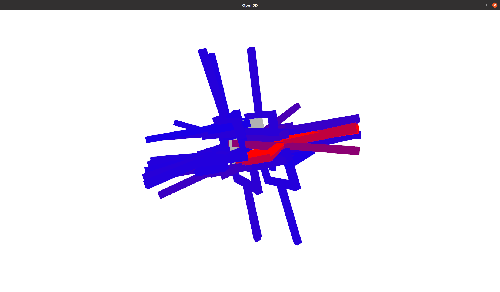
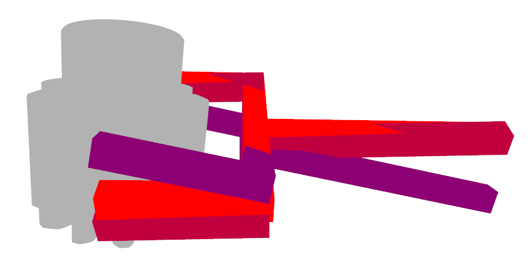

# motivation
通常情况下，大部分人选择使用[PointnetGPD](https://github.com/lianghongzhuo/PointNetGPD)
进行抓取位姿采样，但该方法采样耗时过长，这里我们提供了一种较为简单的[Dex-Net2.0](https://github.com/LaiQE)
的实现。并采用[graspnetAPI](https://github.com/graspnet/graspnetAPI)
进行抓取可视化。

##  easy-dexnet
基于dex-net2.0的论文，较为简单的Dex-Net2.0的实现
对于伯克利的dex-net实现，这里主要进行了如下改动
1. 抓取生成过程中改用tvtpik采样表面对映点，而非使用SDF
2. 对于mesh文件的处理全部由trimesh完成
3. 生成图片样本由pyrender库完成
4. 所有程序全部基于python3.5
除了以上的主要改动，由于这里是完全重写的程序，所有大部分的实现细节也都有改动

### 安装部署
原始的easydexnet是基于python3.5编写。但实践中，可以在python3.6以及3.7中使用 另外tvtk的安装需要pip install mayavi
以下为3.7版本（may be 3.6 is also ok）
```
git clone https://github.com/LaiQE/easy-dexnet.git  
pip install h5py
pip install ruamel.yaml
pip install cvxopt pyhull 
pip install vtk==8.1.2
pip install mayavi==4.7.4
pip install pyglet==1.4.10
cd easy-dexnet  
python setup.py develop
```


##  graspnetAPI
### 安装部署
open3d with different version is ok

```
pip install open3d==0.13.0 -i https://pypi.tuna.tsinghua.edu.cn/simple
pip install graspnetAPI
```

### 使用

```
0. 数据准备 /data/Gear和baota中存放物体模型，obj文件用于抓取采样，ply文件用于可视化抓取
   /data/grasp_reault_gear文件夹存放得到的抓取位姿态（npy形式）
```

```
1. 从obj文件生成所有夹爪与抓取品质并保存到HDF5,参考tools/add_obj_to_hdf5.py
   需要修改ROOT_PATH
   需要改动config/add_obj.yaml配置文件
   包括logging_path(Gear.log存放路径)/hdf5_path(Gear.hdf5存放路径)/obj_path（CAD模型路径）
   结果保存在/template/Gear.hdf5
```
```
2. 从HDF5的数据库中生成gqcnn训练数据(放在out_path里面吧，应该)
   参考tools/generate.py， 需要修改ROOT_PATH
   需要改动config/generate.yaml配置文件
   包括logging_path(Gear.log存放路径)/data_path(Gear.hdf5存放路径)/out_path/table_path
```
```
3. 运行test/test_sunhan.py将采样的抓取位姿态转换为npy形式（test.py为原始的代码）
   该py文件中有一些路径需要修改，详情在文件中搜索‘should be change’
```
```
4. 运行test/show_grasp.py进行可视化，这里抓取质量设置为0.1，即大于0.1的都会进行显示，在代码40行进行修改
```

<br/>
<br/>

##  Possible issues 
1. The CAD model  maybe cause issue. 
2. The sampled grasp poses maybe are not all suitable.

[](https://996.icu)
